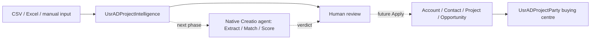

# Architecture

## Foundation and next phase

Package and app technical code: UsrMieleADProjects. Visible title: Project Intake. Existing workplace ID 79cfab3e-7ea3-4fb3-b1ff-d094b8eb3096; preserve its homepage and All employees grant.

The staging record preserves source text and unknown location/type values. Resolution happens later, so a feed is not rejected because a city or stakeholder is unknown. Standard CRM records remain the final destination. Project.Name is a generated identifier; Project.UsrProjectName is the human name.

## Boundaries

- Foundation: objects, defaults, lookup/configuration rows, pages, navigation, input-only import mapping and fictional assets.
- AI phase: S1 extraction, S2 candidate matching, S3 configurable scoring, S4 chat actions, deterministic guardrails, batch/Apply/email workflows and metrics.
- Future connector: authenticated source adapter maps to the same source/input fields. No external LLM keys.
- Legacy: four processes, one AI skill, two C# source schemas and existing pages remain for compatibility. Export inspection found a Lead creation listener on intake insert; see evidence/import-blocker.md.

## Lifecycle

New → Processing → Needs review or Ready to apply → Applied. Rejected is a human disposition. Failed records an execution failure. Missing business information always produces Needs review. Analysis status remains a separate legacy field.

## Access

Employees retain current CRM permissions and workplace membership. Intake use requires object read/create/edit as appropriate. Scoring/configuration writes require administrators. Navigation visibility alone is not proof of object permissions; verify with a nonadmin session and an admin session.

## Reliability

Import matches the pair Source + Source Project ID. Agent reruns may update AI outputs but never reviewer-selected accounts. Apply must be idempotent and create only manifest-tracked demo records during evaluation. Preserve legacy records and original lookup IDs. Read-back and browser evidence are required before marking a checklist item complete.
